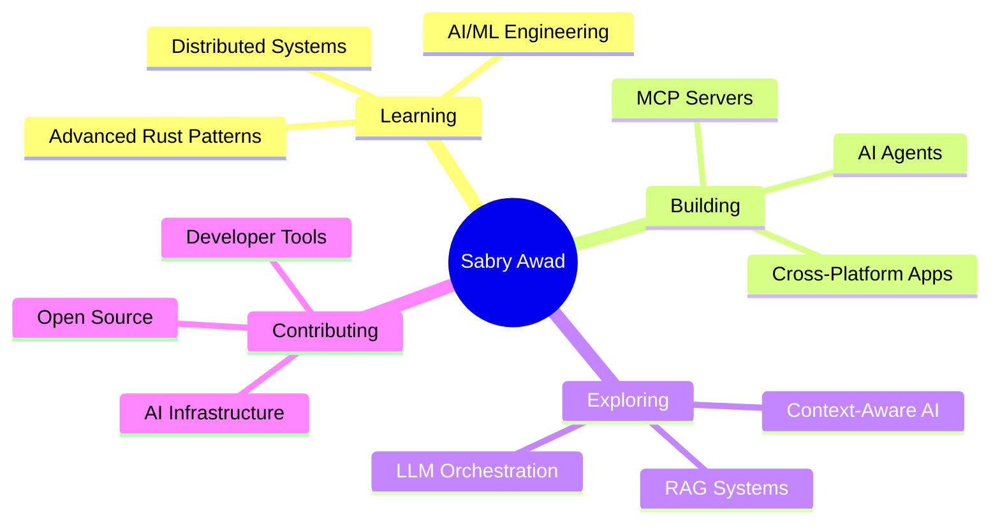

<div align="center">
  
</div>

<div align="center">
  
  ### 💥 Full-Stack Engineer | 🦀 Systems Architect | 🤖 AI Integration Specialist
  
  
  
  [](https://github.com/sabry-awad97)
  [](https://github.com/sabry-awad97)
  [](https://github.com/sabry-awad97)
  
</div>

---

## 🚀 About Me

```typescript
const sabryAwad = {
  title: "Full-Stack Developer & Software Engineer",
  experience: "5+ years",
  location: "🌍 Building the future, one commit at a time",
  
  expertise: {
    frontend: ["React.js", "Next.js", "TypeScript", "TanStack Ecosystem"],
    backend: ["Node.js", "Go", "Rust", "Express", "Hono", "Axum"],
    crossPlatform: ["Tauri", "Electron"],
    databases: ["PostgreSQL", "MongoDB", "Redis"],
    ai: ["OpenAI", "Gemini", "Anthropic", "Ollama", "LangChain", "MCP"],
    devOps: ["Docker", "GitHub Actions", "CI/CD"]
  },
  
  passions: [
    "🤖 AI Agents & LLM Orchestration",
    "🔗 Model Context Protocol (MCP)",
    "⚡ High-Performance Systems",
    "🎨 Modern Web Architecture",
    "📊 Data Visualization"
  ],
  
  currentFocus: "Building intelligent, context-aware applications",
  funFact: "I blend frontend craftsmanship with backend engineering and AI magic ✨"
};
```

<div align="center">
  
  ### 💼 Professional Highlights
  
  🎯 **205+ Open Source Repositories** | 🌟 **Active Contributor** | 🏆 **5+ Years Experience**
  
</div>

---

## 🛠️ Tech Arsenal

<div align="center">

### 💻 Languages


### 🎨 Frontend


### ⚙️ Backend


### 🗄️ Databases


### 🤖 AI & ML


### 🖥️ Cross-Platform


### 🔧 DevOps & Tools


</div>

---

## 🌟 Featured Projects

<div align="center">

<table>
<tr>
<td width="50%">

### 🤖 [AI Knowledge Assistant](https://github.com/sabry-awad97/ai-knowledge-assistant-python)
Production-ready RAG system with local embeddings & Gemini 2.5

**Tech:** Python • FastAPI • PostgreSQL • Weaviate


</td>
<td width="50%">

### 🎨 [Reratui](https://github.com/sabry-awad97/reratui)
Modern Terminal UI framework built in Rust

**Tech:** Rust • TUI • CLI


</td>
</tr>

<tr>
<td width="50%">

### 🌐 [Tauri Nexus](https://github.com/sabry-awad97/tauri-nexus)
Cross-platform desktop application framework

**Tech:** Rust • Tauri • React • TypeScript


</td>
<td width="50%">

### 📦 [Spec Kit MCP](https://github.com/sabry-awad97/spec-kit-mcp)
Model Context Protocol server toolkit

**Tech:** TypeScript • MCP • Node.js


</td>
</tr>

<tr>
<td width="50%">

### 🔍 [mgrep](https://github.com/sabry-awad97/mgrep)
Blazing-fast multithreaded grep tool

**Tech:** Rust • Concurrency • CLI


</td>
<td width="50%">

### 🔧 [Rust MCP Servers](https://github.com/sabry-awad97/rust-mcp-servers)
Collection of MCP servers in Rust

**Tech:** Rust • MCP • Systems Programming


</td>
</tr>
</table>

</div>

---

## 📊 GitHub Analytics

<div align="center">
  
  
</div>

<div align="center">
  
</div>

<div align="center">
  
</div>

---

## 🎯 What I'm Up To

<div align="center">



</div>

---

## 🏆 Achievements & Certifications

<div align="center">

| 🎯 Milestone | 📈 Status |
|-------------|-----------|
| **Public Repositories** | 205+ |
| **Years of Experience** | 5+ |
| **Tech Stack Mastery** | 20+ Technologies |
| **AI/ML Projects** | Production-Ready |
| **Open Source Contributions** | Active |
| **Cross-Platform Development** | Rust + TypeScript |

</div>

---

## 💡 Core Competencies

<div align="center">

🎨 **Frontend Craftsmanship** • ⚙️ **Backend Engineering** • 🤖 **AI Integration**

🚀 **Performance Optimization** • 🏗️ **System Architecture** • 📊 **Data Visualization**

🔄 **CI/CD Pipelines** • 🧪 **Test-Driven Development** • 📱 **Cross-Platform Development**

</div>

---

## 📫 Let's Connect & Collaborate

<div align="center">

[](https://linkedin.com/in/sabry-awad97)
[](https://github.com/sabry-awad97)
[](mailto:sabry.awad97@gmail.com)
[](https://upwork.com)

</div>

---

<div align="center">
  
  ### 💭 Developer Philosophy
  
  *"Blending frontend craftsmanship, backend engineering, and AI integration to build scalable, maintainable, and high-performing applications that make a real-world impact."*
  
  ---
  
  ### ⚡ Fun Facts
  
  🔥 Passionate about **AI Agents** and **MCP**  
  🌟 Love creating **context-aware experiences**  
  🎯 Focused on **healthcare data** impact  
  ☕ Powered by coffee and curiosity  
  
  ---
  
  
  
  
  
</div>
